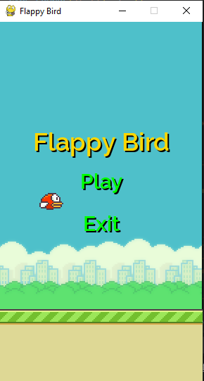
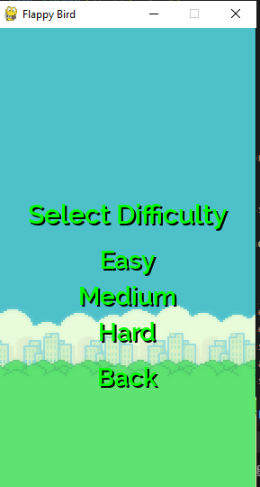
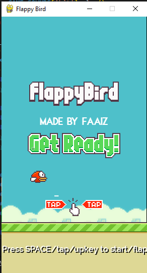
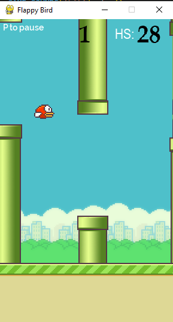
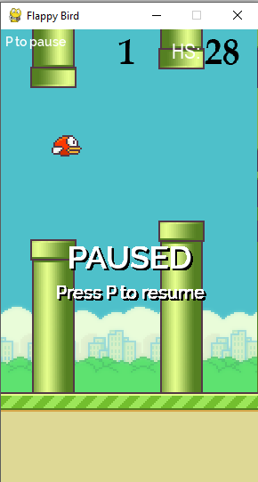
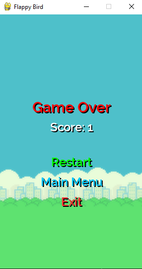

# Flappy Bird Game 🐦
A Python implementation of the classic Flappy Bird game using Pygame, featuring multiple difficulty levels, high score tracking, and smooth gameplay mechanics.
## 🎮 Features

- **Multiple Difficulty Levels:** Easy, Medium, and Hard modes with different pipe speeds and gap sizes
- **High Score System:** Automatically saves and loads your best score
- **Pause Functionality:** Press 'P' to pause/resume the game
- **Interactive Menus:** Main menu, difficulty selection, and game over screens
- **Sound Effects:** Wing flapping, scoring, collision, and menu sounds
- **Smooth Controls:** Keyboard (SPACE/UP) and mouse click controls
- **Visual Feedback:** Shadow effects on text and intuitive button interactions## 📸 Screenshots

### Main menu


### Difficulty Selection Menu


### Instructions


### Gameplay


### Pause menu


### Restart menu


## Installation & Setup 🚀

### Prerequisites
- Python 3.7+
- [Pygame](https://www.pygame.org/) (`pip install pygame`)

### Setup Instructions

1. **Clone the repo**
   ```bash
   git clone https://github.com/your-username/flappy-bird-python.git
   cd flappy-bird-python

2. **Install dependencies**
    ```bash
    pip install pygame
  
3. **Run the game**
    ```bash
    python main.py

## 📁 Folder Structure

flappy-bird-python/

│

├── assets/

│   ├── sprites/         # All images (bird, pipes, background, numbers)

│   ├── audio/           # Game sounds (wing, hit, point, etc.)

│   └── fonts/           # Custom fonts used for buttons and text

├── highscore.txt        # High score saved here

├── main.py            # Main game file

└── README.md            # Project documentation
## How to Play 🎮

1. **Start the Game:** Click "Play" from the main menu
2. **Select Difficulty:** Choose Easy, Medium, or Hard mode
3. **Controls:**

- **SPACE or UP Arrow:** Make the bird flap
- **Mouse Click:** Alternative flap control
- **P:** Pause/Resume during gameplay
- **ESC:** Exit to previous menu or quit game

## Difficulty Levels

- **Easy:** Slower pipes, larger gaps between pipes
- **Medium:** Moderate speed, medium-sized gaps
- **Hard:** Faster pipes, smaller gaps - for experienced players!

## Game Mechanics 🔧

- **Physics:** Realistic gravity and flapping mechanics
- **Scoring:** Earn points by successfully passing through pipes
- **Collision Detection:** Precise hit detection for pipes and ground
- **Progressive Difficulty:** Pipes generate randomly within difficulty constraints

## 🎯 Controls Summary

| **Action**         | **Key / Input**                         |
|--------------------|------------------------------------------|
| Flap               | `SPACE`, `↑ UP Arrow`, Mouse Click       |
| Pause / Resume     | `P`                                      |
| Back / Exit        | `ESC`                                    |
| Menu Navigation    | Mouse Click                              |


## 🎨 Customization
 
- Add your own sprites in the assets/sprites/ folder

- Replace sounds with your own .wav files in assets/audio/

- Adjust difficulty gaps/speed in the get_random_pipe() and main_game() functions

## Technical Details 🛠️

- **Framework:** Pygame
- **Resolution:** 289x511 pixels
- **FPS:** 32 frames per second
- **Audio:** WAV format sound effects
- **Font:** Raleway-SemiBold with Arial fallback

## Building Executable 📦
To create a standalone executable using PyInstaller:
    
    pip install pyinstaller
    pyinstaller --onefile --windowed flappy_bird.py
The game includes resource path handling for PyInstaller compatibility.
## Features in Detail 🎯
### High Score System

- Automatically saves your best score to **highscore.txt**
- Displays current high score during gameplay
- Celebrates new high scores with special message

### Pause System

- Press 'P' during gameplay to pause
- Game state is preserved
- Visual pause indicator with resume instructions

### Menu System

- **Main Menu:** Start game or exit
- **Difficulty Selection:** Choose your challenge level
- **Game Over Screen:** Restart, return to menu, or exit

## Known Issues & Limitations 🐛

- Requires all asset files to be present in the correct directory structure
- Font fallback to system Arial if custom font fails to load
- High score file is created in the same directory as the script


## Future Enhancements 💡

- [ ] Add animated bird sprites
- [ ] Implement power-ups
- [ ] Add background music
- [ ] Create leaderboard system
- [ ] Add particle effects
- [ ] Implement different themes
## License 📜
This project is open source and available under the [MIT](https://choosealicense.com/licenses/mit/)

## Acknowledgments 🙏

- Inspired by the original Flappy Bird game by Dong Nguyen
- Built with Python and Pygame
- Sound effects and sprites from various open-source collections
## Enjoy playing Flappy Bird! 🎮

*If you encounter any issues or have suggestions for improvements, please feel free to open an issue or submit a pull request.*